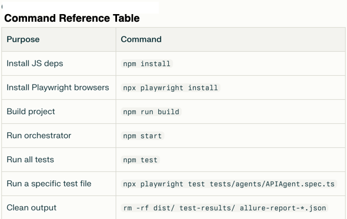
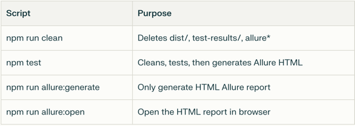
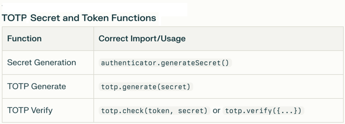
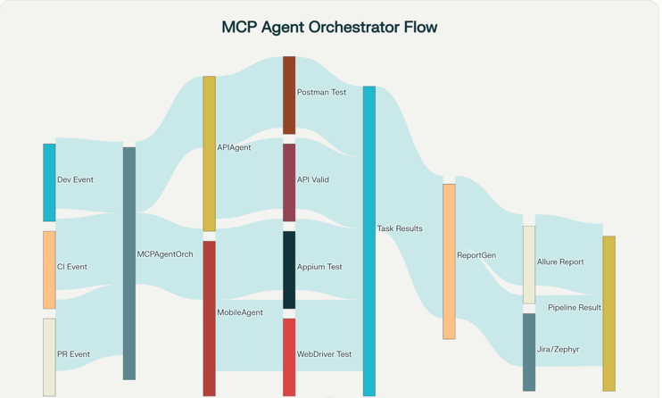

# CI/CD MCP AI Automation Framework

A modular CI/CD MCP AI automation framework in TypeScript, featuring API/Mobile agents, central orchestrator, JSON report generation, and automated testing using Playwright.
This framework integrates Playwright for API testing, WebdriverIO + Appium for mobile (iOS simulator and HeadSpin real device) automation, and separates custom summary results (pipeline-reports/) from Allure's own allure-results/ for robust, clean reporting.

## Project Layout

- `src/` - Source code (agents, orchestrator, reports, types)
- `tests/` - Playwright-based API and mobile tests
- `gen-ai-tests/` - AI generated tests
- `scripts/` - Python scripts
- `data/` - Pseudocode, .json, and .csv files
- `api_tests.json` - Sample Postman collection
- `playwright.config.ts` - Playwright test configuration
- `wdio.conf.ts` - Webdriverio test config
- `package.json`, `tsconfig.json` - Project config

## Getting Started

## Clone the project

git clone https://github.com/girlCoder8/ai-mcp-agent-automation
cd ai-mcp-agent-automation


1. **Install dependencies**

## Project Structure

````
ci-cd-mcp-pipeline/
├── src/
│   ├── agents/               # Core pipeline & AI agent source code
│   ├── reports/              # Report generation modules
│   ├── orchestrator/         # Workflow and process orchestrators
│   ├── config/               # Pipeline and tool configurations
│   └── ...
├── tests/
│   ├── api/                  # Manual & scripted API tests
│   ├── web/                  # Web application tests
│   ├── mobile/               # Mobile app test scripts
│   └── ...
├── gen-ai-tests/             # AI-generated .spec.ts test files
│   ├── playwright/           # Playwright auto-generated tests
│   ├── wdio/                 # WDIO mobile test specs
│   └── ...
├── pipeline-reports/         # Custom JSON summary outputs
├── allure-results/           # Allure raw test result data
├── allure-report/            # Allure HTML report outputs
├── scripts/                  # Automation and AI utility Python scripts
│   ├── generate_playwright_tests_from_csv.py
│   ├── generate_typescript_from_pseudocode.py
│   ├── ai_typescript_test_from_prompt.py
│   ├── generate_wdio_mobile_tests_from_csv.py
│   ├── find_flaky_tests.py
│   ├── predict_pipeline_risks_from_diff.py
│   ├── auto_create_jira_bugs.py
│   └── requirements.txt      # Python script dependencies
├── assets/                   # Images for documentation
├── data/
│   ├── pseudocode/           # High-level test case pseudocode
│   ├── manual_test_cases.csv # Manual test case definitions
│   ├── mobile_tests.csv      # Mobile-specific test definitions
│   ├── recent_diff.txt       # Recent code diffs for risk prediction
│   ├── latest_failures.json  # Track recent test failures
│   └── test_run_history.json # Test suite execution history
├── .env                      # Environment variables (API keys, credentials)
├── docs/                     # Documentation and guides
│   ├── automation_challenges_legacy.md
│   ├── automation_failure_case.md
│   ├── data_compatibility_and_security.md
│   ├── data_privacy_multiagent.md
│   ├── mcp_validation_plan.md
│   ├── preventing_ai_data_leaks.md
│   └── some_security_risks.md
├── package.json              # Node.js dependencies and scripts
├── README.md                 # This file
├── .gitignore
├── api_tests.json            # API tests definition/config
├── playwright.config.ts      # Playwright configuration
├── Dockerfile                # Docker container spec
├── docker-compose.yml        # Multi-container orchestration
├── tsconfig.json             # TypeScript config (main)
├── tsconfig.test.json        # TypeScript config (tests)
└── wdio.conf.ts              # WebdriverIO configuration

````

| Directory/Path                        | Description                                                                                                  |
|----------------------------------------|--------------------------------------------------------------------------------------------------------------|
| src/types/enums.ts                     | EventType, AgentType, TaskStatus enums                                                                       |
| src/types/interfaces.ts                | CIPipelineEvent, TaskResult, AgentReport, PipelineResult interfaces                                          |
| src/agents/BaseAgent.ts                | Abstract base class for agents                                                                               |
| src/agents/APIAgent.ts, MobileAgent.ts | Concrete agent classes (API and Mobile)                                                                      |
| src/reports/ReportGenerator.ts         | Utilities for report generation (Allure, Zephyr/Jira sync, etc.)                                             |
| src/orchestrator/MCPAgentOrchestrator.ts| The main orchestrator class                                                                                  |
| src/utils/                             | Helper utilities (delay functions, error handling, etc.)                                                     |
| src/index.ts                           | Application entry point; creates the orchestrator and triggers pipeline flows                                |
| tests/                                 | Automated test suites (unit/integration), using Jest, Mocha, etc.                                            |
| api_tests.json                         | API test definitions/collection (Postman format, referenced by API agents)                                   |
| gen-tests/                             | Storage for AI-generated TypeScript test scripts, for Playwright/WebdriverIO                                 |
| scripts/generate_tests_from_csv.py     | Python script to ingest CSV test cases and generate .spec.ts files using AI (e.g., OpenAI GPT)               |
| data/manual_test_cases.csv             | Manual test case spreadsheet (CSV), used as input for the test generator                                     |
| scripts/requirements.txt               | Python dependencies list (OpenAI, pandas, tqdm, etc.)                                                        |

If you need to batch pseudocode files, it is best to use meaningful names for each one (e.g., TestCaseID_001.pseudo).

When converting pseudocode to TypeScript, you can use a Python script, and you can have the script read from pseudocode/ and output to gen-tests/ or another directory of your choice.

### How to run the Python scripts
This creates .spec.ts files under gen-ai-tests/.

``` 
pip install -r scripts/requirements.txt

```
### Requirements
Python 3.8+
- Packages: openai (or azure-ai, anthropic, etc.), pandas, tqdm
- An API key for your AI provider, e.g., OpenAI

- .env
Now also supports API keys/secrets for Python scripts (e.g., OPENAI_API_KEY)

## How to Run the Package Scripts

``` 
    "build": "tsc",
    "clean": "rm -rf dist/ test-results/ allure-report/ allure-results/ pipeline-reports/ reports/ allure-wdio-results",
    "allure:generate": "npx allure generate allure-results -o allure-report || echo 'allure results generating report from.'",
    "allure:open": "npx allure open allure-report",
    "test:web": "npx playwright test tests/web",
    "test:api": "npx playwright test tests/api",
    "test:wdio:mobile": "wdio run wdio.conf.ts",
    "test:wdio:simulator": "npx wdio run src/config/wdio.ios.conf.js",
    "test:wdio:headspin": "npx wdio run src/config/wdio.headspin.ios.conf.js",
    "test:wdio-ios": "npx wdio run ./src/config/wdio.ios.conf.js",
    "test:wdio-headspin": "npx wdio run ./src/config/wdio.headspin.ios.conf.js",
    "playwright:test": "npx playwright test",
    "start": "npm run build && node dist/index.js"

OR

# To just run the TOTP Secret tests
npx playwright test tests/auth/totp.spec.ts

```

✅ 1. Run the tests with WebdriverIO:
For iOS Simulator:
npx wdio src/config/wdio.ios.conf.js

✅ 2. For HeadSpin Real Device:
npx wdio src/config/wdio.headspin.ios.conf.js

Only Playwright’s Allure reporter (enabled via playwright.config.ts) should write to allure-results/.

Your custom pipeline summary JSON is written to pipeline-reports/.

Your allure:generate and allure:open scripts will now work without CLI errors.

Old .json files in allure-results/ should be deleted.

### Command Reference Table


### Script Commands


### Secret Token Functions


### AI Agent Workflow Diagram for MCP Agent Orchestrator



